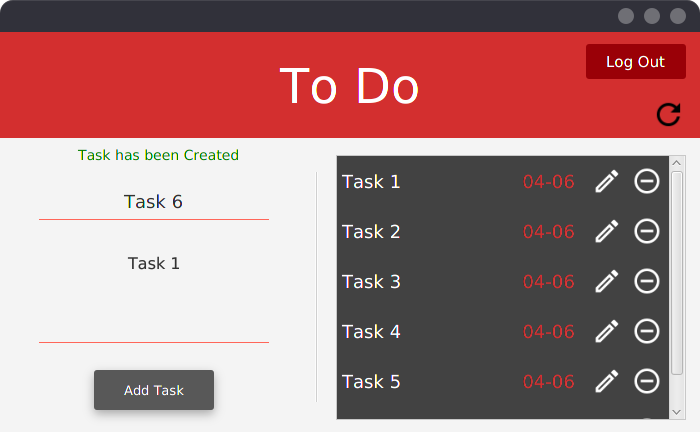
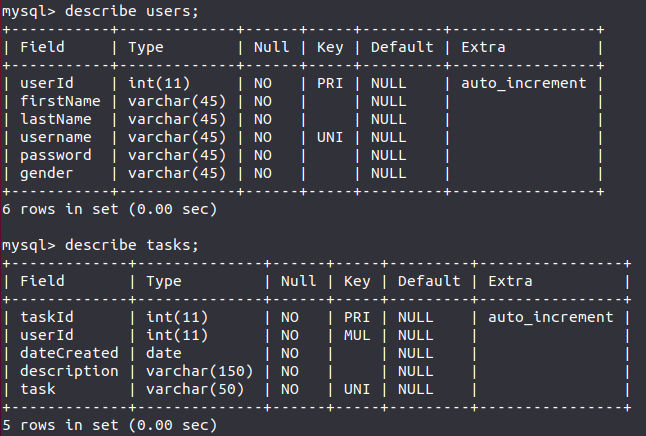

TODO Application
======

A small application for keeping your all tasks organized in one place.
It's written in Java using JavaFX.
The user can:
* create account
* login
* add tasks
* delete tasks
* edit tasks
* view tasks

### That's how it looks

### And here are tables

### Libraries
To run you need:
* Java
* MySQL

## Feel Free to Download and Change Code

